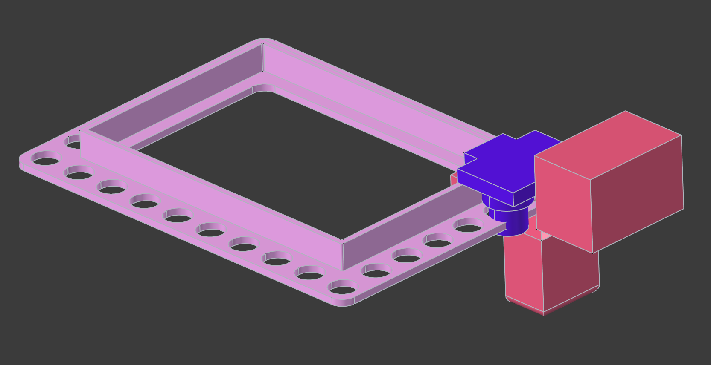
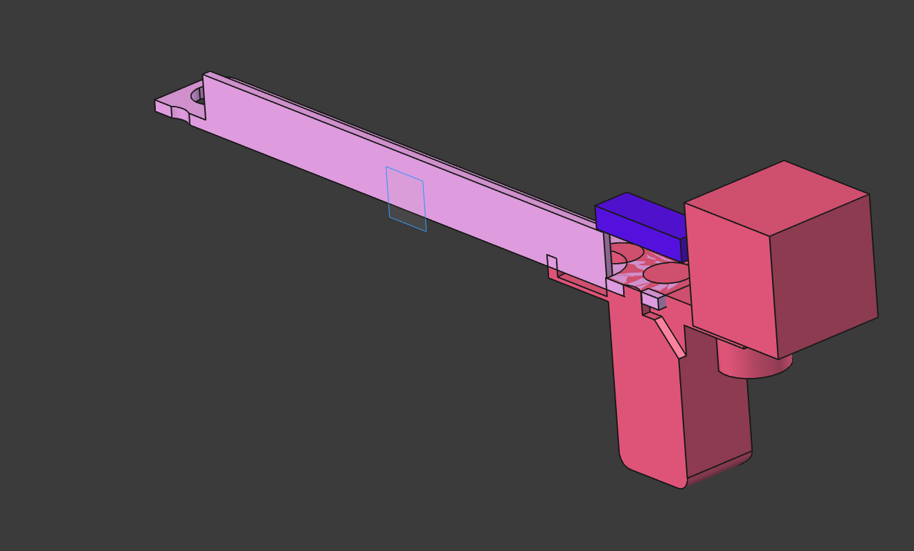
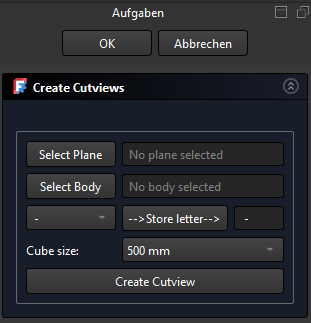
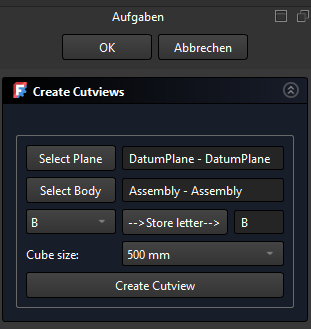
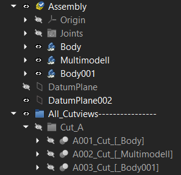
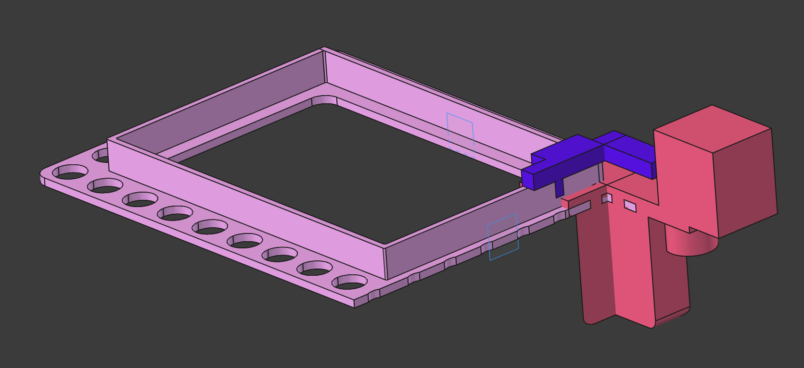

# FreeCAD_Cut_view_V2
Macro to create cut_views in FreeCAD
=================================

This macro provides a graphical user interface (GUI) in FreeCAD to automate the creation of cut views for assemblies or parts. 
It is designed to streamline the workflow for generating sectional views by guiding the user through a series of selections and actions. 
The macro is modular and interacts with other scripts for group structure creation, link management, cube generation, and cut operations.

Features:
---------
- **Plane Selection:**
  Select a `Part::Plane` or `Part::DatumPlane` from the 3D view. 
  The selected plane's name and label are displayed in the GUI.

- **Body Selection:**
  Select any body object (e.g., `Part::Body`, `App::Part`, `Assembly::Assembly`, etc.). 
  The selected body's name and label are shown in the GUI.

- **Cutview Letter Assignment:**
  Assign a letter (A-Z) to the cutview, which is used for group naming and organization.

- **Cube Size Selection:**
  Choose the cube size (500 mm to 5000 mm in 500 mm increments) for the cut operation.

- **Automated Workflow:**
  Includes buttons to execute the following steps individually or as a complete sequence:
    - Create group structure    (visibility = False by default, watch in the code)
    - Create links              (visibility = False by default, watch in the code)
    - Create cubes              (visibility = False by default, watch in the code)
    - Perform cuts              (visibility = False by default, watch in the code)
    - Execute all steps in order ("Create Cutview")

- **State Management:**
  Checks for existing groups, links, cubes, and cuts to prevent duplicate operations and ensure a consistent workflow.

- **User Feedback:**
  Provides real-time feedback and error messages in the FreeCAD console and GUI fields.

Usage:
------

1. Deactivate the part or assembly to avoid circular references.
2. Create a plane for the cut.
3. Run this macro in FreeCAD.

The blank Taskwindow---------->

5. Use the GUI to select a plane and a body from the 3D view or the tree.
6. Assign a letter for the cutview and store it (the letter will be used for group naming).
7. Select the desired cube size (required for the cut operation).

The fully selected Taskwindow-->

8. Click the "Create Cutview" button to perform the cutview.

9. You can also show more cutviews at the same time, so it shows 90°-cut (toggle the visibility with the space button).

10. If the cut is in the wrong direction, select the plane, reverse it, and recompute everything.

Installation:
-------------
1. Copy all the following `.py` files into your FreeCAD macros directory:
   
   `C:\Users\<YourUsername>\AppData\Roaming\FreeCAD\Macro`
   
   - A010_create_Cutviews.py
   - A020_create_group_structure.py
   - A030_create_links.py
   - A040_create_cubes.py
   - A050_create_cuts.py

2. In FreeCAD, open the Macro dialog and run only `A010_create_Cutviews.py`.
   
   The other scripts will be called automatically by `A010_create_Cutviews.py` as needed. You do not need to run them manually.

Dependencies:
-------------
- FreeCAD 1.1.0dev
- PySide (Qt for Python)
- The following scripts must be present in the same directory:
    - A020_create_group_structure.py
    - A030_create_links.py
    - A040_create_cubes.py
    - A050_create_cuts.py

License:
--------
MIT License

Copyright (c) 2025 PuLs4r

Permission is hereby granted, free of charge, to any person obtaining a copy
of this software and associated documentation files (the "Software"), to deal
in the Software without restriction, including without limitation the rights
to use, copy, modify, merge, publish, distribute, sublicense, and/or sell
copies of the Software, and to permit persons to whom the Software is
furnished to do so, subject to the following conditions:

The above copyright notice and this permission notice shall be included in all
copies or substantial portions of the Software.

THE SOFTWARE IS PROVIDED "AS IS", WITHOUT WARRANTY OF ANY KIND, EXPRESS OR
IMPLIED, INCLUDING BUT NOT LIMITED TO THE WARRANTIES OF MERCHANTABILITY,
FITNESS FOR A PARTICULAR PURPOSE AND NONINFRINGEMENT. IN NO EVENT SHALL THE
AUTHORS OR COPYRIGHT HOLDERS BE LIABLE FOR ANY CLAIM, DAMAGES OR OTHER
LIABILITY, WHETHER IN AN ACTION OF CONTRACT, TORT OR OTHERWISE, ARISING FROM,
OUT OF OR IN CONNECTION WITH THE SOFTWARE OR THE USE OR OTHER DEALINGS IN THE
SOFTWARE.
